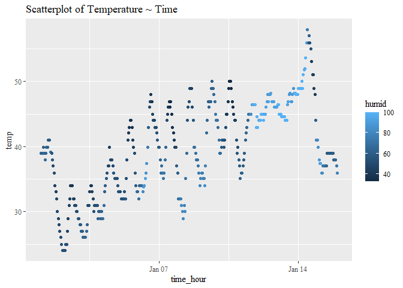

p8105_hw1_sm5592
================
Shaolei Ma
2023-09-20

# Problem 1

First, load the data set and describe it.

``` r
data("early_january_weather") # load the dataset
summary(early_january_weather$temp)
```

    ##    Min. 1st Qu.  Median    Mean 3rd Qu.    Max. 
    ##   24.08   33.98   39.02   39.58   44.96   57.92

- The data set has 358 rows and 15 columns.  
- It contains the following 15 variables: origin, year, month, day,
  hour, temp, dewp, humid, wind_dir, wind_speed, wind_gust, precip,
  pressure, visib, time_hour. As the temperature and humidity are about
  to be evaluated below, I take these as important variables. For
  temperature, the `min`, `max`, `median` values respectively are 24.08,
  57.92, 39.02; For humidity, the `min`, `max`, `median` values
  respectively are 32.86, 100, 61.67.

Then, make a scatterplot.

``` r
ggplot(early_january_weather, aes(x = time_hour, y = temp, color = humid)) + 
  geom_point() + labs(title = "Scatterplot of Temperature ~ Time") +
  theme(text = element_text(family = "serif")) # change fonts
```

<!-- -->

``` r
ggsave("scatterplot_hw1.jpg")
```

From the scatterplot, the temperature increases overall over the time
period and fluctuates within each day with the peak forming usually in
the afternoon. The humidity is relatively steady except for the time
window between January 13 and January 14, and the humidity drop on
January 14 marks the highest temperature over the period.

# Problem 2

Create a data frame comprised of:

- a random sample of size 10 from a standard Normal distribution  
- a logical vector indicating whether elements of the sample are greater
  than 0  
- a character vector consisting of the sample converted to character  
- a factor vector measuring the value of the sample

``` r
dat = 
  tibble(
    var_numeric = rnorm(10),
    var_logical = var_numeric > 0,
    var_char = as.character(var_numeric),
    var_factor = factor(case_when(
      var_numeric < 0 ~ "1", # if x < 0, then label it "low".
      var_numeric >= 0 & var_numeric < 0.5 ~ "2", # if 0 <= x < 0.5, then label it "med".
      var_numeric >= 0.5 ~ "3"), # if x >= 0.5, then label it "high".
      labels = c("low", "med", "high"),
      levels = c("1", "2", "3"), ordered = T
      )
  )
```

Show the first rows of the data frame:

    ## # A tibble: 6 × 4
    ##   var_numeric var_logical var_char           var_factor
    ##         <dbl> <lgl>       <chr>              <ord>     
    ## 1      -0.557 FALSE       -0.556984613599924 low       
    ## 2      -0.367 FALSE       -0.36746400552124  low       
    ## 3      -0.890 FALSE       -0.889606244916554 low       
    ## 4      -0.479 FALSE       -0.479168469609101 low       
    ## 5       0.552 TRUE        0.552306019967631  high      
    ## 6      -0.305 FALSE       -0.304592165165049 low

Calculate the means of each variable:

``` r
for(variable in variable.names(dat))
  print(paste("The mean for variable '", variable, "' is ", dat %>% pull(variable) %>% mean %>% round(digits = 2), ".", sep = ""))
```

    ## [1] "The mean for variable 'var_numeric' is -0.47."
    ## [1] "The mean for variable 'var_logical' is 0.1."

    ## Warning in mean.default(.): argument is not numeric or logical: returning NA

    ## [1] "The mean for variable 'var_char' is NA."

    ## Warning in mean.default(.): argument is not numeric or logical: returning NA

    ## [1] "The mean for variable 'var_factor' is NA."

Both the numeric and logical variables yield results, while the
character and factor variables yield NA.  
Try to convert the logical, character, and factor variables to numeric
variables.

``` r
for(variable in variable.names(dat))
{
  if(variable == "var_numeric") next # skip the numeric variable
  print(paste("The mean for variable '", variable, "' is ", dat %>% pull(variable) %>% as.numeric %>% mean %>% round(digits = 2), ".", sep = ""))
}
```

All yield an output. It could be concluded that for the function mean(),
the logical variable is converted to numeric and then computed, while
the character and factor variables are not converted by default.
